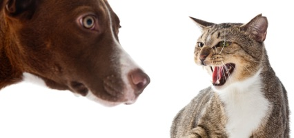
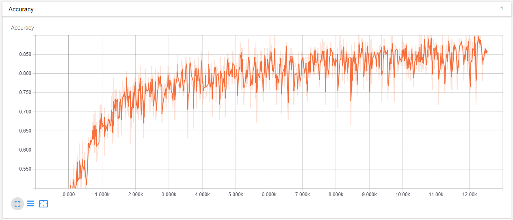
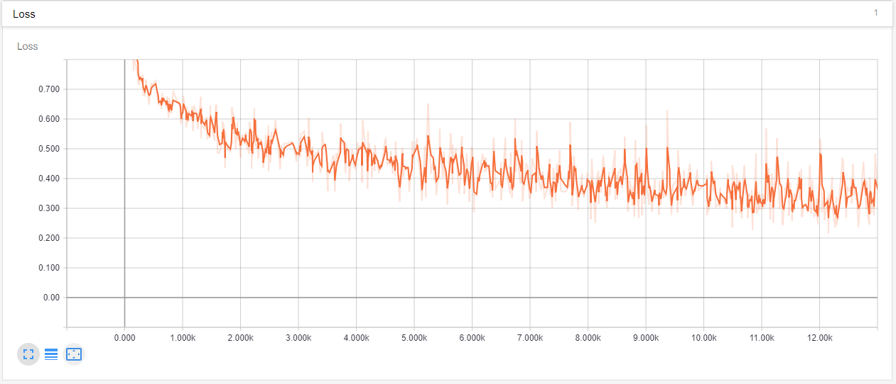

# Kaggle Dogs vs Cats with Tensorflow
  
Dogs vs cats is a competition hosted on Kaggle, the aim is for the participants to write an algorithm for computers to classify images containing dogs or cats.   
  

## Preprocessing  
The dataset is too large to fit into memory all at once, so it is first wrote into a HDF5 file as described in @pyimagesearch _Deep Learning for Computer Vision with Python_ book. 
Images are first scaled down (maintaining the aspect ratio), then a 256x256 patch from the centre is cropped. The training dataset from Kaggle is split into 3 sets: 20000 for training, 2500 for validation and 2500 for testing.   
  
## AlexNet
The AlexNet model is implemented with Tensorflow for this project. The model was trained for 200 epochs and it completed in ~8hours. Images are randomly augmented during training to reduce overfitting, my implementation is slow thus the long duration of training. An 88% accuracy is achieved on the testing set (this result is very different from the Keras implementation reported in the _Deep Learning for Computer Vision with Python_ book, any ideas?)  

### Tensorboard training graphs  



```
utils: folder contatining Python files to preprocess images.
build_h5_dataset.ipynb: write the images and labels into a HDF5 file.
train_alexnet.ipynb: implementing AlexNet in Tensorflow and training
```

